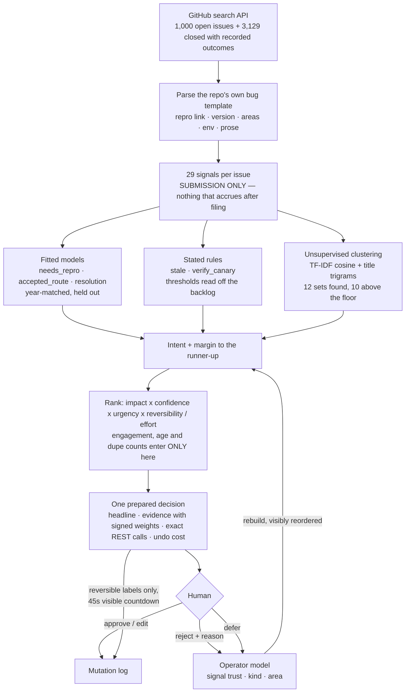

# Docket

**1,010 open issues. 65 decisions. No list, no chat box.**

A non-chat, non-dashboard interface for one real job: triaging the
[vercel/next.js](https://github.com/vercel/next.js/issues) issue backlog. It runs on the real
backlog — every card links to an issue you can open and check — and it shows one prepared decision
at a time, with the evidence, the exact API calls it would send, and what it costs to undo.

Built for the [DOO Builders League "Beyond the Chatbot" challenge](https://build.doo.ooo/challenges/beyond-the-chatbot).

- **Live demo:** https://beyond-the-chatbot-hazel.vercel.app
- **Repository:** https://github.com/MFahd7/beyond-the-chatbot

---

## The job, and why chat and dashboards both lose it

Issue triage for a large open-source project is a real salaried job. Somebody opens the backlog
every morning and decides, for each report: can an engineer act on this, is it a duplicate, is it
already fixed, is anyone still waiting, who owns it. Next.js has **1,010 open issues** and a label
taxonomy built specifically for this work — `please add a complete reproduction`,
`please verify canary`, `linear: turbopack`, `stale`. The vocabulary of the decision already exists.

**The dashboard** — `github.com/vercel/next.js/issues` — is 1,010 rows, newest first. That ordering
is not a choice anyone made; it is the only ordering a list can produce when it has no model of
what the reader is trying to do. The thing most worth doing is not at the top, and there is no
column you can sort by to put it there.

**The assistant** — any "Ask AI about this repo" box — fails structurally rather than for lack of a
good model. A chat window is request/response: it waits for a question that already contains the
shape of its answer. To ask *"are #74147 and #74149 the same bug?"* you must first have found both,
which is the entire job. And once it has answered, it cannot act.

**The docket** does the part that is actually hard — deciding what deserves attention next — and
leaves the human the part that needs judgment: yes, no, not like that. Press `\` in the live demo
to see all three side by side, rendered from the same 1,000 issues rather than screenshotted.

---

## Run it

Built and tested on Node 24.19. `package.json` sets the floor at Node 20.9, which is what Next 16
requires. No API key, no database, no accounts — `data/corpus.json` is committed, so a clean clone
runs offline.

```bash
git clone https://github.com/MFahd7/beyond-the-chatbot.git
cd beyond-the-chatbot
npm install
npm run dev          # http://localhost:3000
```

```bash
npm test             # 48 tests, including both named failure cases
npm run typecheck
npm run build
```

**Re-pull the data** (optional, needs network; `GITHUB_TOKEN` raises the rate limit from 10/min to
30/min but no token is required):

```bash
npm run data:refresh   # fetch → build → fit
npm run data:fit       # refit from the committed features.json, offline
```

---

## Decisions and sweeps

The interface's first honest version produced **694 cases from 1,000 issues**, 368 of which said
"this is a real defect, route it". That is not a decision queue — it is the same backlog in a nicer
font, and it fails at the one thing the interface claims to do.

The mistake was assuming every decision is one issue wide. Two different things were being conflated:

|  | | |
|---|---|---|
| **A judgment** | Is #74147 the same bug as #74149? Does this regression deserve to jump the queue? | Depends on the specific issue. One card each. |
| **A sweep** | 115 issues are five or more release lines behind and should be asked to retest. | The question is not "what about this issue" but "do I trust this rule on these 115". One card, reviewed by sampling. |

Splitting them takes the docket from 694 cards to **65** while still covering every issue: 44
judgments, 21 sweeps, 759 issues covered, and the remaining 241 listed with a reason (press `?`).
Those two numbers add up to the backlog, which is the only thing that makes hiding anything
defensible.

---

## Architecture snapshot



The full account is in [ARCHITECTURE.md](ARCHITECTURE.md). The one rule worth stating here:

> **Prediction and prioritisation get different inputs.**
>
> Every fitted feature describes the *submission* — what the reporter typed, in the state they left
> it. Labels, comment counts, reactions, assignees, age: all excluded, because each accumulates
> *after* triage and would let the model read the outcome off the back of the card. A
> `needs_repro` issue has a comment precisely because a maintainer asked for a reproduction.
>
> Those same fields are exactly the right inputs for *ranking*, which makes no historical
> prediction at all. So they appear in `core/attention.ts` and nowhere else.
>
> This split is enforced by a test, not a convention: [`tests/leakage.spec.ts`](tests/leakage.spec.ts)
> takes a real issue, mutates every post-filing field on it, and asserts the fitted feature vector
> comes back bit-identical.

---

## What is learned, what is stated, and what was cut

Fitted against **3,129 decisions the maintainers actually made**, recovered from the repo's own
triage labels and GitHub's close reasons.

| model | held-out accuracy | AUC | n | in use? |
|---|---|---|---|---|
| `accepted_route` — is this a real, routable defect? | 70.9% | **0.775** | 196 | yes |
| `needs_repro` — can anyone act on this as written? | 68.8% | **0.767** | 202 | yes |
| `resolution` — will this close without a fix? | 63.4% | 0.698 | 380 | ranking only |
| `stale_close` | 61.5% | 0.662 | 192 | **no** |
| `verify_canary` | 59.5% | 0.553 | 74 | **no** |

Every training set is balanced *within each creation year* and scored on a held-out quarter of its
own year-matched set, so **50% is the honest baseline**, not the class prior. `i` in the live demo
shows this table with the verdicts.

**Why the era matching is not optional.** Label usage is stratified by time: `please add a complete
reproduction` is mostly 2022–23, the `stale` sweeps were 2024, `linear:` routing began in 2024.
Sampled naively, the classes come back almost temporally *disjoint* — and the fastest way to
separate them is then to read the calendar off the version number. The model would score
beautifully in cross-validation and predict one class for everything on a current backlog. So
negatives are drawn following the positives' own year distribution, and version lag is measured
against the release line current *at filing* rather than today.

**Why two models were cut.** Both failed for the same reason, and it is the same reason the feature
rule above exists. Whether an issue is going nowhere depends on the *silence that followed it*;
whether it is already fixed depends on where the release line has *moved since*. Neither fact is in
the report, so neither model ever had a chance. `verify_canary` landed at chance and was dropped
outright. `stale_close` is the interesting one: at AUC 0.662 it clears the 0.65 bar set before
fitting, and it is still not used — the rule in `core/rules.ts` gets to look at the 274 days of
silence and the absence of anyone waiting, so it holds strictly more of the relevant information
than the model that beat the bar without them. "Quiet for 274 days, nobody assigned" is also
something a maintainer can argue with in a way a coefficient is not.

Both remain in `data/weights.json` and `data/eval.json` so the claim can be checked rather than
taken on trust. Duplicate detection is unsupervised — the repo's `discussion-is-duplicate` label
applies to discussions, not issues, and maintainers close duplicates with prose comments the search
API will not return — so it is the one part of the system with **no measured accuracy**, and every
card says so rather than borrowing the classifier's credibility.

---

## The one action it takes on its own

Exactly one, and the gate is **reversibility, not confidence**.

A label goes on and comes off and nobody is notified, so a confident model is allowed to apply one.
A comment lands in the inbox of everyone watching the issue the instant it posts, and deleting it
afterwards does not unsend the mail — so no confidence score buys permission to send one. Closing
somebody's bug report is likewise a person's decision.

The practical effect is that autonomy and irreversibility are separated: **the system does the
filing on its own and leaves the talking to a human.** On the `needs_repro` sweep, the members the
model is most confident about (≥ 0.70) have their label applied automatically after a **45-second
visible countdown**; the comments and closes in the same set wait. Any keystroke stops the timer —
consent has to be active, not merely unobjected-to. An autonomous action nobody can see coming is
indistinguishable from a bug, which is also why a card with a running timer is always the first card
in the docket, ahead of anything with a higher score.

By default nothing is sent anywhere. The corpus is somebody else's bug tracker and a demo has no
business commenting on 1,000 open issues that real people are waiting on, so approving commits to a
local mutation log and shows the exact request. Set `GITHUB_WRITE_TOKEN` and `DOCKET_TARGET_REPO` to
a repository you own and the same drafts execute for real. The review model is identical either way.

---

## The failure test: when it guesses wrong

An interface that shows one decision and hides 999 issues is making a far stronger claim than a
list. That is only acceptable if being wrong is **cheap, specific and visible**.

So rejection is never a thumbs-down. It carries a reason, and each reason edits a different part of
the model — because "wrong" is not one piece of information, and a single downvote throws away the
part that would have been useful:

| `r` then… | what was wrong | what changes |
|---|---|---|
| `1` Read it wrong | The reading itself | Distrusts the signals that drove *this* reading — everywhere they appear, since a signal that lied once will lie in the next model that uses it |
| `2` Wrong response | Reading fine, action wrong | Keeps the signals, demotes that kind of decision |
| `3` Not now | Decision fine, moment wrong | Demotes the kind in the ranking but keeps it visible, and less harshly than `2` |
| `4` Not my area | Decision fine, not your code | Demotes the areas, touches the reasoning not at all |
| `5` Evidence expired | Sound reasoning on stale facts | Distrusts only the time-based signals |

Then the panel shows **what actually moved** — every multiplier with its before and after value, and
every case that changed position by name. `#74147 · 2 → 9` is something you can check against your
own judgment; "queue updated" is something you have to take on faith, and taking a ranking on faith
is how people stop correcting it.

Four guarantees, each with a test in
[`tests/failure-a.spec.ts`](tests/failure-a.spec.ts) and
[`tests/failure-b.spec.ts`](tests/failure-b.spec.ts):

1. **Corrections are specific.** Rejecting one card edits the signals that caused it and leaves
   every other signal, kind and area exactly where they were.
2. **Corrections cannot destroy the model.** Multipliers are clamped to [0.1, 2.0], so twenty-five
   rejections in a row still leave a working docket. Approval nudges (×1.06) far less than rejection
   shoves (×0.55) — someone clearing a queue is weaker evidence than someone stopping to object.
3. **Demotion is withheld, never deleted.** Teach it to stop showing you something and those issues
   appear under `?` reading *"you demoted stale_close to ×0.09 by rejecting earlier cases"*. An
   operator who cannot find out why they stopped seeing something has lost part of their backlog.
4. **Nothing vanishes.** Covered + withheld = the whole backlog, asserted on the real corpus.

There is also a wrong guess sitting in the live demo on purpose. `[SRI] integrity missing for
client chunks` (#74147) and `for stylesheets` (#74149) cluster at cohesion 0.54 — comfortably
above the floor — and are *related but genuinely separate* bugs. It is a good illustration of what unsupervised similarity gets wrong, and
of what `1` then does about it.

---

## Notes

**Three bugs worth admitting**, because each was silent, each produced plausible output, and each
invalidated something downstream. They are the reason the tests exist in the shape they do.

1. **The section parser returned nothing, for the whole corpus.** The regex ended
   `(?=\n#{1,6}\s|$)` under the `m` flag, where `$` matches the end of *every* line — so the lazy
   capture terminated immediately and every template section came back empty. Areas were unparsed,
   `area.declared` was a dead feature, and the models reported respectable numbers anyway. Fixing it
   moved `needs_repro` from 0.710 to 0.767 and `stale_close` from 0.589 to 0.662.
2. **Version lag counted in the wrong unit.** Ordering packed majors at 1e6 and minors at 1e3, so a
   single major bump read as 1,000 minor versions; the feature saturated to a near-binary flag while
   the evidence line would have told the user "999.9 versions behind". Now it counts real release
   lines shipped in between.
3. **Screenshots made unrelated issues look alike.** Two reports — one about startup memory, one
   about a source-map failure — scored 0.45 cosine because both pasted a screenshot, and GitHub
   expands a pasted screenshot into ``. The shared vocabulary was the
   attachment markup.

**Duplicate thresholds were read off the data, not chosen.** `npx tsx scripts/tune-clusters.ts`
prints the pairs each bar accepts and rejects. The first guess (cosine ≥ 0.62) found three clusters
in a thousand issues; body cosine on this corpus tops out near 0.55 and the highest-cosine pairs
were *not* the best duplicates. Title trigram overlap turned out to be the more trustworthy measure
— the title is the one line a reporter writes deliberately and contains no pasted output to drift
on — so the title leads and the body corroborates. Ten of the twelve resulting clusters are genuine
duplicates on manual inspection; the two that are not are described above.

**AI tools used.** Claude Opus 5 via Claude Code, for essentially all of it: the fetch and fit
pipeline, the inference layer, the interface, the tests and these docs. The data work was
conversational and adversarial rather than generative — the confound in the label distribution, the
three bugs above, and the decisions/sweeps split all came out of measuring the corpus and finding
the first answer wrong. No language model runs at request time; `ANTHROPIC_API_KEY` is accepted but
unused by the shipped pipeline, and every number here was produced with it unset.

**Out of scope, deliberately.**

- **Writing to `vercel/next.js`.** Drafts are exact and executable; the default target is a local
  log. See above.
- **Issue comments and timeline events.** The search API returns bodies but not comment threads, and
  fetching 1,000 threads unauthenticated is days of rate limit. So duplicate ground truth (which
  lives in "duplicate of #X" comments) is unavailable, and clustering is unsupervised as a result.
- **Multi-operator state.** The operator model lives in the browser and is posted with each request,
  which keeps the server a pure function of `(corpus, weights, model, clock)`. A real deployment
  would persist it per maintainer.
- **The backlog beyond 1,000.** GitHub's search API refuses to page past 1,000 results per query.
  The repo reports 1,010 open issues; the corpus holds 1,000 of them.
- **Undoing an executed mutation.** The undo *cost* is computed and displayed on every card;
  actually reversing a write needs the write path, which is off by default.

---

## Repository

```
core/                the pipeline, pure and framework-free
  types.ts           the vocabulary, and where the shipped/cut line is drawn
  text.ts            template stripping, TF-IDF, cosine, trigrams
  templates.ts       parse the repo's bug template out of a filled-in body
  signals.ts         29 submission-only features + the release timeline
  rules.ts           the stated thresholds, with the measurements behind them
  cluster.ts         duplicate detection, and why the thresholds are what they are
  intent.ts          score the fitted models, combine with rules, keep the margin
  attention.ts       expected value of attention — the ranking
  actions.ts         draft real GitHub mutations; decide what may self-apply
  operator.ts        what a correction changes
  docket.ts          compose it all: decisions, sweeps, and the withheld list
app/                 one route, one client component, no component library
scripts/
  fetch-corpus.mjs   paced, cached, resumable GitHub fetch
  build-corpus.ts    parse + signal + cluster → data/corpus.json
  fit-weights.ts     fit + evaluate → data/weights.json, data/eval.json
  tune-clusters.ts   where the similarity thresholds came from
  probe-docket.ts    the docket on the command line, without the interface
data/                corpus, features, weights, eval — all committed
tests/               48 tests, including the two named failure cases
```

[ARCHITECTURE.md](ARCHITECTURE.md) · [THESIS.md](THESIS.md) · [DEPLOY.md](DEPLOY.md)
